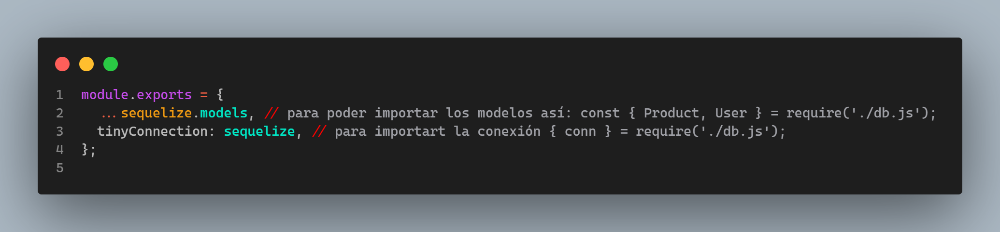
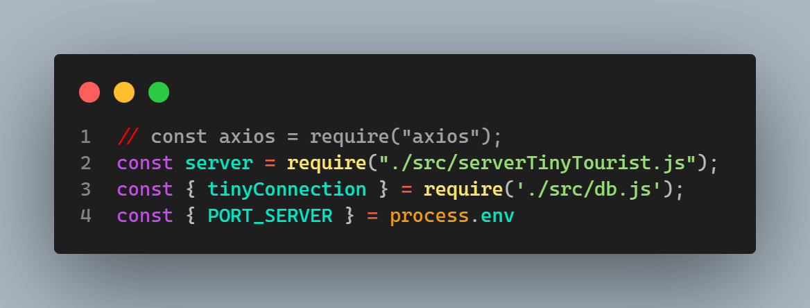

  

        <h1>Proyecto  Individual Tiny Tourist: Country Explores. </h1>
        
   El presente proyecto como parte del proceso de formación que tengo en Henry, está centrado en la temática de "countries", usé las tecnologías que he venido fortaleciendo en el bootcamp, asegurando así un desarrollo eficiente y alineado con los requisitos establecidos. Considero que las aplicaciones son más impactantes cuando se adaptan a grupos poblacionales específicos y sus necesidades particulares.

Después de explorar numerosos ejemplos y reflexionar sobre el propósito de mi aplicación -demostrar que sé aplicar-, he decidido enfocar la app hacia un público infantil. Creo fervientemente que las aplicaciones pueden ser herramientas educativas y de entretenimiento. Mi objetivo es crear una aplicación que brinde información sobre países según los requerimientos establecidos, buscando hacerla atractiva para el público infantil, y proporcionando una experiencia enriquecedora mientras exploran países y crean actividades turísticas para estos. Se toma la <a href="readmeHenryMain.md">guía técnica I </a> así como la  <a href="IniciandoUnPI.md">Guía técnica II </a> como los referentes para el desarrollo de la APP.  
Para esta se retomaron clases y se creó una guía técnica del desarrollo de la app donde se mostró el día a día y paso a paso. 
  
    

    
 - <b> BackEnd</b> - 

        DÍA 1- 17-Dic-23
        <ul>
        <li> Creación carpeta para imágenes del codeo diario y evolución / incluye videos.</li> 
        <li> Verificación de la estructura del proyecto. Trae client y server. En server gran parte montado.</a>
<li> 

  

    Análisis del Obj País
  

  <ul>
    <li>Total de propiedades: 41</li>
  </ul>
  <ul> <b> ARRAY DE OBJS [{}, {}] </b>
    <li>Top-Level Domain (tld): Array con 1 elemento (".co").</li>
    <li>Latitud y Longitud (latlng): Array con 2 elementos (latitud y longitud).</li>
    <li>Países vecinos (borders): Array con 5 elementos (códigos de país).</li>
  </ul>
  <ul> <b> OBJETOS </b>
    <li>Nombre (name): Objeto con 3 propiedades (common, official, nativeName).</li>
    <li>Nombre Nativo (nativeName): Objeto con 1 propiedad (spa).</li>
    <li>Monedas (currencies): Objeto con 1 propiedad (COP).</li>
    <li>Códigos Internacionales (idd): Objeto con 2 propiedades (root, suffixes).</li>
    <li>Idiomas (languages): Objeto con 1 propiedad (spa).</li>
    <li>Traducciones (translations): Objeto con múltiples propiedades (árabe, checo, galés, alemán, etc.).</li>
    <li>Gentilicios (demonyms): Objeto con 2 propiedades (eng, fra).</li>
    <li>Enlaces a mapas (maps): Objeto con 2 propiedades (googleMaps, openStreetMaps).</li>
    <li>Coeficiente Gini (gini): Objeto con 1 propiedad (2019).</li>
    <li>Enlaces a banderas (flags): Objeto con 2 propiedades (png, svg).</li>
    <li>Escudo de Armas (coatOfArms): Objeto con 2 propiedades (png, svg).</li>
    <li>Inicio de la semana (startOfWeek): Objeto con 1 propiedad (monday).</li>
    <li>Información de la capital (capitalInfo): Objeto con 1 propiedad (latlng).</li>
  </ul>
  <ul> <b> ANIDAMIENTOS </b>
    <li>Nombre tiene una propiedad anidada (Nombre Nativo).</li>
    <li>Nombre Nativo tiene una propiedad anidada (spa).</li>
    <li>Monedas tiene una propiedad anidada (COP).</li>
    <li>Códigos Internacionales tiene una propiedad anidada (suffixes).</li>
    <li>Gentilicios tiene dos propiedades anidadas (eng, fra).</li>
    <li>Enlaces a mapas tiene dos propiedades anidadas (googleMaps, openStreetMaps).</li>
    <li>Enlaces a banderas tiene dos propiedades anidadas (png, svg).</li>
    <li>Escudo de Armas tiene dos propiedades anidadas (png, svg).</li>
    <li>Información de la capital tiene una propiedad anidada (latlng).</li>
<li> </li>
  </ul>

</li>
</li>

 
<li> 
 
 Verificación del packege.json identificando: a) axios, b) concurrently para 2 puertos al tiempo, c) cors, d) dotenv, e) express, f) json-server, g) morgan, h) nodemon, i) npm-run-all, j) pg, k) pg-hstore, l) sequelize. 
      

      <li>   </li>
      <ul>
 </li>

 <li> 
 
Creación estructura archivos en el back
 
 
 Se crean las diferentes carpetas que manejaran la lógica. 
 

 
 </li> 
 
<li> 
 
npm i para instalar las dependencias
 
 
 Se instalan las dependencias. 
 

 
 </li> 
 
<li> 
 
Se crea la base de datos llamada tinytouristcountriesexplorers 
 
 
 Se crea mediante CREATE DATABASE tinytouristcountriesexplorers;
 

 
 </li> 

 <li> 
 
Se configuran variables de entorno .env / dotenv()
 
 
 Se hace configuración inicial del .env y se crea en esta la variable de DB_NAME la cual se modifica en db.js. 
 

 
 
 </li> 

 <li> 
 
Se lanza npm start para verificar correcto funcionameinto 
 
 
 </li> 

  <li> 
 
Se configura puerto y se da firma personal según el proyecto
 
 
 se modifican tanto como index como db.  
 

 
 
 </li> 
         </ul>
DIA 2. 18-Dic-23
<ul> 
<li> 
 
Rebautizo del Server
 
 
 Se rebautiza server según la lógica del negocio.  
 

 
 
 </li>
 <li>Se empieza trabajando con rutas.</li>

 <li>Se cambia la ruta del BackEnd por mainRouterManager y se cambia tanto en el server como .</li>
<li> 
 
Se empieza con rutas iniciales
 
 
  </li>

  <li> 
 
Se modularizan rutas tanto del get como del post.  
 
  
 Se generan 2 carpetas para las rutas 

 
 <li>los archivos se ven así: </li>
 
 
 
 
  </li>

<li> 
 
Modularización de handlers
 
 
 
 
  </li>

<li> 
 
Exportación de handlers
 
 
 
 
 
  </li>

  <li> 
 
se verifican rutas por query y params
 
 <li>Por query </li>
 
http://localhost:3001/countries?name=betto

 
 <li>Por params </li>
 
http://localhost:3001/countries/ACA

 

  </li>

</ul>
