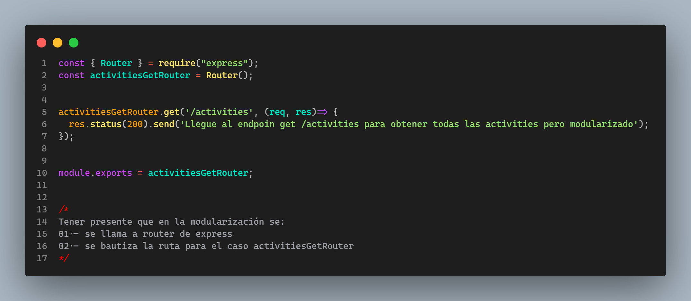
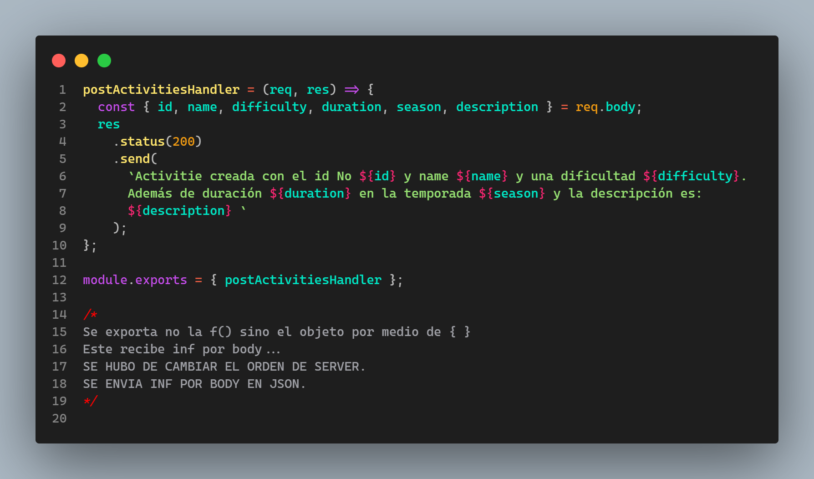

  

        <h1>Proyecto  Individual Tiny Tourist: Country Explores. </h1>
        
   El presente proyecto como parte del proceso de formación que tengo en Henry, está centrado en la temática de "countries", usé las tecnologías que he venido fortaleciendo en el bootcamp, asegurando así un desarrollo eficiente y alineado con los requisitos establecidos. Considero que las aplicaciones son más impactantes cuando se adaptan a grupos poblacionales específicos y sus necesidades particulares.

Después de explorar numerosos ejemplos y reflexionar sobre el propósito de mi aplicación -demostrar que sé aplicar-, he decidido enfocar la app hacia un público infantil. Creo fervientemente que las aplicaciones pueden ser herramientas educativas y de entretenimiento. Mi objetivo es crear una aplicación que brinde información sobre países según los requerimientos establecidos, buscando hacerla atractiva para el público infantil, y proporcionando una experiencia enriquecedora mientras exploran países y crean actividades turísticas para estos. Se toma la <a href="readmeHenryMain.md">guía técnica I </a> así como la  <a href="IniciandoUnPI.md">Guía técnica II </a> como los referentes para el desarrollo de la APP.  
Para esta se retomaron clases y se creó una guía técnica del desarrollo de la app donde se mostró el día a día y paso a paso. 
  
    

        
 - <b> BackEnd</b> - 

        DÍA 1.- 17-Dic-23
        <ul>
        <li> Creación carpeta para imágenes del codeo diario y evolución / incluye videos.</li> 
        <li> Verificación de la estructura del proyecto. Trae client y server. En server gran parte montado.</a>
<li> 

  

    Análisis del Obj País
  

  <ul>
    <li>Total de propiedades: 41</li>
  </ul>
  <ul> <b> ARRAY DE OBJS [{}, {}] </b>
    <li>Top-Level Domain (tld): Array con 1 elemento (".co").</li>
    <li>Latitud y Longitud (latlng): Array con 2 elementos (latitud y longitud).</li>
    <li>Países vecinos (borders): Array con 5 elementos (códigos de país).</li>
  </ul>
  <ul> <b> OBJETOS </b>
    <li>Nombre (name): Objeto con 3 propiedades (common, official, nativeName).</li>
    <li>Nombre Nativo (nativeName): Objeto con 1 propiedad (spa).</li>
    <li>Monedas (currencies): Objeto con 1 propiedad (COP).</li>
    <li>Códigos Internacionales (idd): Objeto con 2 propiedades (root, suffixes).</li>
    <li>Idiomas (languages): Objeto con 1 propiedad (spa).</li>
    <li>Traducciones (translations): Objeto con múltiples propiedades (árabe, checo, galés, alemán, etc.).</li>
    <li>Gentilicios (demonyms): Objeto con 2 propiedades (eng, fra).</li>
    <li>Enlaces a mapas (maps): Objeto con 2 propiedades (googleMaps, openStreetMaps).</li>
    <li>Coeficiente Gini (gini): Objeto con 1 propiedad (2019).</li>
    <li>Enlaces a banderas (flags): Objeto con 2 propiedades (png, svg).</li>
    <li>Escudo de Armas (coatOfArms): Objeto con 2 propiedades (png, svg).</li>
    <li>Inicio de la semana (startOfWeek): Objeto con 1 propiedad (monday).</li>
    <li>Información de la capital (capitalInfo): Objeto con 1 propiedad (latlng).</li>
  </ul>
  <ul> <b> ANIDAMIENTOS </b>
    <li>Nombre tiene una propiedad anidada (Nombre Nativo).</li>
    <li>Nombre Nativo tiene una propiedad anidada (spa).</li>
    <li>Monedas tiene una propiedad anidada (COP).</li>
    <li>Códigos Internacionales tiene una propiedad anidada (suffixes).</li>
    <li>Gentilicios tiene dos propiedades anidadas (eng, fra).</li>
    <li>Enlaces a mapas tiene dos propiedades anidadas (googleMaps, openStreetMaps).</li>
    <li>Enlaces a banderas tiene dos propiedades anidadas (png, svg).</li>
    <li>Escudo de Armas tiene dos propiedades anidadas (png, svg).</li>
    <li>Información de la capital tiene una propiedad anidada (latlng).</li>
<li> </li>
  </ul>

</li>
</li>

<li> 
 
 Verificación del packege.json identificando: a) axios, b) concurrently para 2 puertos al tiempo, c) cors, d) dotenv, e) express, f) json-server, g) morgan, h) nodemon, i) npm-run-all, j) pg, k) pg-hstore, l) sequelize. 
      

      <li>   </li>
      <ul>
 </li>

 <li> 
 
Creación estructura archivos en el back
 
 
 Se crean las diferentes carpetas que manejaran la lógica. 
 

 
 </li> 
 
<li> 
 
npm i para instalar las dependencias
 
 
 Se instalan las dependencias. 
 

 
 </li> 
 
<li> 
 
Se crea la base de datos llamada tinytouristcountriesexplorers 
 
 
 Se crea mediante CREATE DATABASE tinytouristcountriesexplorers;
 

 
 </li>

 <li> 
 
Se configuran variables de entorno .env / dotenv()
 
 
 Se hace configuración inicial del .env y se crea en esta la variable de DB_NAME la cual se modifica en db.js. 
 

 
 
 </li>

 <li> 
 
Se lanza npm start para verificar correcto funcionameinto 
 
 
 </li>

  <li> 
 
Se configura puerto y se da firma personal según el proyecto
 
 
 se modifican tanto como index como db.  
 

 
 
 </li> 
         </ul>
DÍA 2.- 18-Dic-23
<ul> 
<li> 
 
Rebautizo del Server
 
 
 Se rebautiza server según la lógica del negocio.  
 

 
 
 </li>
 <li>Se empieza trabajando con rutas.</li>

 <li>Se cambia la ruta del BackEnd por mainRouterManager y se cambia tanto en el server como en la mainRouter .</li>
<li> 
 
Se empieza con rutas iniciales
 
 
  </li>

  <li> 
 
Se modularizan rutas tanto del get como del post.  
 
  
 Se generan 2 carpetas para las rutas 

 
 <li>los archivos se ven así: </li>
 
 
 
 
  </li>

<li> 
 
Modularización de handlers
 
 
 
 
  </li>

<li> 
 
Exportación de handlers
 
 
 
 
 
  </li>

  <li> 
 
se verifican rutas por query y params
 
 <li>Por query </li>
 
http://localhost:3001/countries?name=betto

 
 <li>Por params </li>
 
http://localhost:3001/countries/ACA

 
</li>

  <li> 
 
se verifican rutas por body en post
 
 
POST http://localhost:3001/activities

 <code> {  
  "name": "Caminatas",  
  "difficulty": 2,  
  "duration": 1,  
  "season": "Autumn",  
  "description": "Ojo te roban", 
  "id": "COL"  
}</code>
 
 <li>Por params </li>
 
http://localhost:3001/countries/ACA

 
</li>

  <li> 
 
Modelos
 
 
Se completa el modelo de Country 

<ol>
    <li><strong>id:</strong> Código único de tres letras que sirve como clave primaria y es obligatorio.</li>
    <li><strong>name:</strong> Nombre único y obligatorio del país.</li>
    <li><strong>officialname:</strong> Nombre oficial del país (opcional).</li>
    <li><strong>flag:</strong> URL única y obligatoria de la imagen de la bandera, validada como URL.</li>
    <li><strong>continent:</strong> Continente al que pertenece el país, obligatorio.</li>
    <li><strong>capital:</strong> Capital del país, obligatoria.</li>
    <li><strong>subregion:</strong> Subregión a la que pertenece el país (opcional).</li>
    <li><strong>area:</strong> Área del país (opcional).</li>
    <li><strong>maps:</strong> URL del mapa del país, opcional y validada como URL.</li>
    <li><strong>population:</strong> Población del país (opcional).</li>
    <li><strong>timezones:</strong> Zona horaria del país (opcional).</li>
    <li><strong>coatOfArms:</strong> URL del escudo del país, opcional y validada como URL.</li>
<li>La opción { timestamps: false } indica que no se incluirán marcas de tiempo de creación y actualización en la tabla.</li>
</ol>

 
Se crea el modelo de Activity => si se crea archivo vacio sin exportar rompe por la db como la tiene Henry

<ol>
    <li><strong>id:</strong> ID NUMERICO UUID COMO PRIMARY KEY OBLIGA. clave primaria, no nula, y valor predeterminado generado automáticamente.</li>
    <li><strong>name:</strong> NAME CON VALIDACIÓN DE NO PALABRAS. campo de cadena no permite palabras por validación notIn.</li>
    <li> <strong>difficulty:</strong> DIFICULTAD CON VALIDACIÓN DE VALOR EN RANGO. campo numérico entero de 1 -5 validado</li>
    <li><strong>duration:</strong> DURACIÓN. campo numérico entero.</li>
    <li><strong>season:</strong> TEMPORADA. opciones "Summer", "Autumn", "Winter" "Spring".</li>
    <li><strong>description:</strong> DESCRIPCIÓN PARRAFO EN TEXT. campo de texto para la descripción de la actividad.</li>
    <li><strong>date_added:</strong> FECHA DE ADICIÓN A DB EN FORMATO MM/DD/AAAA. valor predeterminado con la de hoy.</li>
    <li><strong>createdInDb:</strong> BOOLEANO DE SI CREADO EN DB Y UTIL CUANDO QUIERO CONSULTAR LLAMADO A API Y BD DIFERENTES COMO QUE APLICA MÁS PARA POKEMON.</li>
    <li><strong>summary:</strong> CAMPO VIRTUAL DE CLASE AURI. NECESARIO? NO. SIRVE PARA NO ALMACENAR DIRECTAMENTE EN BD.</li>
</ol>
<li>El tercer argumento, si está presente, permite o impide la inclusión de marcas de tiempo de creación y actualización en la tabla. En este caso, se han incluido ({ timestamps: true }).</li>
</li>
<li> 
 
Modelos y Relaciones
 

El modelo ER

 

En la carpeta modelos se montan cada uno en un archivo

 

En db se entablan las relaciones

 
  </li>

<li> 
 
Controladores
 

Se crea estructura de archivos. 

 

En la carpeta modelos se montan cada uno en un archivo

 

En db se entablan las relaciones

 
  </li>
</ul>

---

    
 - <b> FrontEnd</b> - 

       DÍA 3.- 19-Dic-23
    <ul>
        <li>Instalación de dotEnv para variables de entorno en front.</li>
        <li>Verificación de la estructura del front. Montado en vite.</li>
  <li> 
 
Modificación HTML principal
 

Se Modifica el HTML para que tenga un favicono, description, etc. 

 
        <li>Se eliminan los estilos predeterminados del main eliminando index.css y su llamado en main</li>
        <li>Se modifica el estilado de CSS en app dejando fuentes predeterminadas y contenidos centrados</li>
        <li>Se reconfigura App.jsx limpiandolo para configurar en él el router</li>

  </li>
    </ul>

